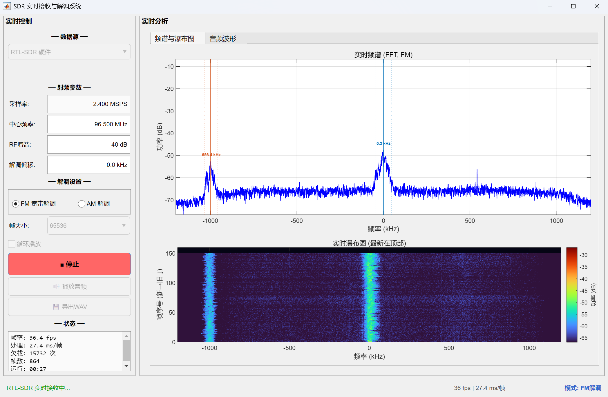

# SDR 实时信号接收与解调系统

数字无线电系统设计课程设计项目。基于 MATLAB 实现 AM/FM 信号的实时流式解调，支持文件回放和 RTL-SDR 硬件接收。

> **注意**：由于缺少 AM 天线，AM 解调功能尚未通过实际接收验证。FM 解调已通过 RTL-SDR Blog V4 实际测试，可正常接收广播信号。

## 功能

- **双模式数据源**
  - 文件回放：从 IQ 基带 WAV 文件逐帧读取，等速播放，音画同步
  - RTL-SDR 硬件：实时接收空中信号，帧大小最高 131072（多块拼接突破 32768 硬件限制）
- **AM/FM 解调**
  - FM：正交鉴频 + 跨帧相位连续 + 去加重（50 μs）
  - AM：相干包络检波 + 运行指数均值 DC 去除
- **实时可视化**
  - 频谱图（Welch PSD + 自动信号检测标注）
  - 瀑布图（环形缓冲，从上往下流动）
  - 音频波形（2 秒滚动窗口）
  - AM/FM 自动切换显示范围（AM ±30 kHz / FM 全带宽）
- **运行时交互**
  - 实时调整中心频率、RF 增益、解调偏移（无需停止处理）
  - 模式切换自动调至经典频率（FM 96.5 MHz / AM 1 MHz）
- **音频处理**：实时播放 + 累积导出 WAV
- **性能数据自动记录**：RTL-SDR 模式下自动以 CSV 格式记录帧率、处理耗时、欠载计数（每 ~5 秒一行，追加写入，零开销）

## 文件结构

| 文件 | 说明 |
|------|------|
| `sdr_realtime_processor.m` | 主程序：GUI + 处理循环 + 流式 DSP 函数 + 性能日志 |
| `sdr_offline_processor.m` | 离线批量 IQ 文件处理（参考实现） |
| `perf-data.csv` | 性能测试原始数据（自动生成，CSV 格式，追加写入） |
| `实时解调系统技术方案.md` | 完整技术文档：架构、DSP 算法、性能优化 |
| `实时解调性能优化记录.md` | 性能优化历程与效果总结 |
| `技术方案.md` | 原始设计计划 |
| `.gitignore` | Git 忽略规则 |

## 环境要求

- MATLAB R2023a
- Signal Processing Toolbox
- RTL-SDR 硬件模式额外需要：
  - [Communications Toolbox Support Package for RTL-SDR Radio](https://www.mathworks.com/hardware-support/rtl-sdr.html)
  - RTL-SDR Blog V4（或其他 RTL2832U 系列）接收机
  - Audio Toolbox（推荐，无此工具箱自动回退 `sound()`）

## 快速开始

### 文件回放模式

1. 在 MATLAB 中运行 `sdr_realtime_processor`
2. 数据源选择 **"文件回放"**
3. 点击 **"选择IQ文件"** 载入 WAV 格式 IQ 录音
4. 查看频谱预览，根据需要设置解调偏移
5. 选择模式（FM/AM），点击 **"开始处理"**
6. 处理完成后可播放或导出音频

### RTL-SDR 实时接收

1. 插入 RTL-SDR 接收机
2. 数据源选择 **"RTL-SDR 硬件"**
3. 设置中心频率（默认 96.5 MHz FM 广播）、RF 增益、解调偏移
4. 点击 **"开始处理"**，即可实时接收和解调

## GUI 截图

## 性能优化

详见 [实时解调性能优化记录](实时解调性能优化记录.md)：

1. **FIR 滤波器缩短**（80 dB → 60 dB）：抽头数减少 55%，滤波运算量减半
2. **DDC 混频表预计算**：32768 次 `exp()`/帧 → 仅在参数变化时计算 1 次
3. **RTL-SDR 大帧支持**：多次读取硬件块拼接为完整 IQ 帧，突破单次读取 32768 样点限制
4. **默认参数优化**：开箱可用，无需频繁调参

## 技术要点

- 流式 DSP：`filter(b, a, x, zi)` 保持滤波器状态跨帧连续
- FM 相位连续性：跨帧拼接 `last_iq` 保证 `unwrap` 无缝
- DC 去除：运行指数均值（EMA），非全局均值
- 显示节流：每 3 帧更新，`drawnow limitrate`

## 许可证

本项目为课程设计作业，仅供学习参考。
