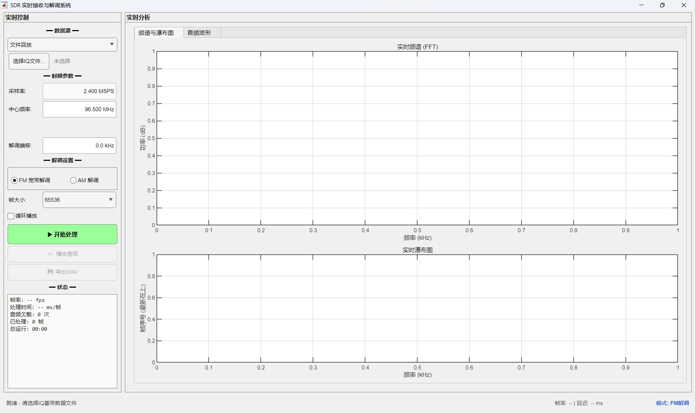

# SDR 实时信号接收与解调系统 — 技术方案（当前实现）

> **版本**: v2.1 | **更新日期**: 2026-06-01
>
> 本文档描述 `sdr_realtime_processor.m` 的当前实现状态，包含经过多轮迭代优化后的完整技术细节。
> 原始设计计划见 `技术方案.md`，性能优化历程见 `实时解调性能优化记录.md`。

---

## 1. 系统概述

本系统实现从 IQ 基带数据源逐帧读取、实时流式 AM/FM 解调、低延迟音频输出以及频谱/瀑布图/音频波形的实时可视化。

**数据源支持：**
- **文件回放**：从 WAV 格式 IQ 基带文件逐帧读取，模拟实时流
- **RTL-SDR 硬件**：通过 `comm.SDRRTLReceiver` 直接驱动 RTL-SDR 接收机

**已移除的功能：** rtl_tcp TCP 流式数据源（早期实验后移除）

---

## 2. 总体架构

```text
┌─────────────────────────────────────────────────────────────┐
│                        处理循环                              │
│                                                             │
│  数据源 ─→ 帧读取 ─→ 频道选择(DDC+LPF) ─→ 解调(AM/FM)       │
│     │                    │                   │              │
│     │                    │                   │              │
│     │              DDC表缓存             多级降采样           │
│     │              (预计算exp)           (级联FIR+抽取)       │
│     │                                       │              │
│     │                                       ▼              │
│     │                              audioDeviceWriter ─→ 扬声器│
│     │                                       │              │
│     │                                       ▼              │
│     │                              频谱显示 + 瀑布图 + 波形   │
│     │                              (每3帧更新, 节流至~10Hz)  │
│     │                                                       │
│     └── 运行时参数即时更新: fc, gain, f_offset                │
└─────────────────────────────────────────────────────────────┘
```

**关键设计原则：**
- 所有 DSP 运算为**双精度**（`double`），保证数值稳定性和精度
- 滤波器状态在帧边界**保持连续性**（`filter(b,a,x,zi)` 返回 `zf` 作为下一帧 `zi`）
- DDC 混频表预计算缓存，`f_offset` 不变时复用（消除每帧 32768+ 次 `exp()` 调用）
- 帧处理时间 < 帧时长是消除音频卡顿的根本条件

---

## 3. 文件结构

```text
sdr_realtime_processor()          % 主函数 (~1323行)：构建 GUI + 定义回调 + 处理循环
│
├── GUI 构建（顶层，第96-305行）
│   ├── 单例窗口 (Tag='SdrRealtimeProcessor')
│   ├── 主布局: [控制面板(260px) | 显示区域(可变)]
│   ├── Tab 组件: 频谱+瀑布图 / 音频波形
│   └── 状态栏: 状态文本 / 性能指标 / 模式标签
│
├── 回调函数（第307-603行）
│   ├── browse_callback()          % 选择 IQ 文件 + 频谱预览
│   ├── quick_spectrum_preview()   % 开始前预览频谱，便于设置解调偏移
│   ├── source_changed_callback()  % 切换数据源 (文件↔RTL-SDR)
│   ├── mode_changed_callback()    % 切换 AM↔FM + 自动调整中心频率
│   ├── play_callback()            % 播放已解调音频
│   ├── export_callback()          % 导出 WAV
│   ├── start_stop_callback()      % 开始/停止处理
│   └── close_callback()           % 窗口关闭清理
│
├── 处理循环 processing_loop()（第631-855行）
│   ├── 数据源操作: open/read/close (文件 + RTL-SDR)
│   ├── 运行时参数即时更新: apply_runtime_params()
│   ├── 滤波器预设计: design_channel_filter(), design_demod_filters()
│   ├── 流式处理主循环 (6步/帧):
│   │    1. apply_runtime_params() → 检查 fc/gain/f_offset 变更
│   │    2. read_data_frame() → 获取一帧 IQ
│   │    3. channel_select_stream() → DDC + 信道滤波
│   │    4. am/fm_demodulate_stream() → 解调
│   │    5. 音频输出 (audioDeviceWriter / sound)
│   │    6. 显示更新 (节流) + 性能统计
│   └── 文件回放调速: pause() 强制等速，消除读快于播的累积卡顿
│
└── 文件末局部函数（第1326-1697行）
    ├── channel_select_stream()         % 流式 DDC + 信道滤波
    ├── am_demodulate_stream()          % 流式 AM 包络检波
    ├── fm_demodulate_stream()          % 流式 FM 正交鉴频
    ├── multistage_decimate_stream()    % 流式多级降采样
    ├── compute_frame_fft_display()     % 单帧 Welch FFT
    └── detect_signals()                % 信号检测与标注
```

---

## 4. GUI 布局



*窗口尺寸 1200×760，左侧控制面板 260px 固定宽度，右侧为 Tab 组件（频谱与瀑布图 / 音频波形）。*

**控件说明：**

| 控件 | 类型 | 默认值 | 运行时 | 说明 |
|------|------|--------|--------|------|
| 数据源 | `uidropdown` | 文件回放 | 锁定 | 文件回放 / RTL-SDR 硬件 |
| 选择IQ文件 | `uibutton` | — | RTL-SDR模式下隐藏 | 打开文件选择对话框 |
| 采样率 | `uieditfield` | 2.400 MSPS | 文件回放只读 | 文件模式自动读取; RTL-SDR模式可设 |
| 中心频率 | `uieditfield` | 96.500 MHz | **可修改** | 精度 1 kHz (3 位小数) |
| RF 增益 | `uieditfield` | 40 dB | **可修改** | 仅 RTL-SDR 可见 (0~49.6 dB) |
| 解调偏移 | `uieditfield` | 0.0 kHz | **可修改** | 精度 100 Hz (1 位小数) |
| 调制模式 | `uibuttongroup` | FM | 锁定 | FM 宽带解调 / AM 解调 |
| 帧大小 | `uidropdown` | 65536 | 锁定 | 16384 / 32768 / 65536 / 131072 |
| 循环播放 | `uicheckbox` | □ | 文件模式可用 | 文件播完后自动回绕 |
| 开始/停止 | `uibutton` | ▶ 开始 | 切换 | 启动/停止处理循环 |

**运行时锁定/可编辑规则：**
- 锁定（需停止后修改）：数据源、帧大小、模式
- **可实时修改**：中心频率、RF 增益、解调偏移（在 RTL-SDR 模式下即时生效）

---

## 5. 数据源实现

### 5.1 文件回放

**打开** (`open_file_source`, 第887-927行)：
- 使用 `audioinfo` 自动获取采样率和总长度
- 回退方案：`audioread` 小片段获取采样率，`dir` 获取文件大小估算长度
- 打开 `fopen(fid, 'rb')` 作为备用句柄

**逐帧读取** (`read_file_frame`, 第929-955行)：
- 使用 `audioread(filepath, [start, end], 'native')` 范围读取
- 分离 I/Q 通道: `complex(double(I), double(Q))`
- 末帧不足时填零补足
- 返回 `done` 标志指示文件是否读完

**文件回放调速** (第802-809行)：

```matlab
t_audio = length(audio_frame) / state.audio_fs;
t_target = state.frame_count * t_audio;
t_actual = toc(state.t_start);
if t_actual < t_target
    pause(t_target - t_actual);
end
```

按音频时间线强制同步：帧处理太快时 `pause()` 等待，确保播放速度与实时一致。

### 5.2 RTL-SDR 硬件

**打开** (`open_rtlsdr_source`, 第972-995行)：

```matlab
rtl_frame = min(state.frame_size, 32768);  % 硬件单次读取上限
state.source_handle = comm.SDRRTLReceiver('0', ...
    'CenterFrequency',     state.source_fc, ...
    'SampleRate',          state.source_fs, ...
    'OutputDataType',      'double', ...
    'SamplesPerFrame',     rtl_frame, ...
    'EnableTunerAGC',      false, ...
    'TunerGain',           state.source_gain);
```

- 获取实际采样率（硬件可能不完全等于请求值），回写到 GUI

**多块拼接读取** (`read_rtlsdr_frame`, 第998-1018行)：
- RTL-SDR 硬件限制每次 `step()` 最多 32768 样点
- 对于更大的帧（如 65536, 131072），循环读取 `ceil(frame_size/32768)` 次
- 各块拼接为一个完整 IQ 帧
- 异常时返回零帧，不中断循环

**预热** (第687-692行)：启动后丢弃前 5 帧，等待硬件增益和 PLL 稳定。

---

## 6. 主处理循环

```text
每帧执行 6 步:
┌────────────────────────────────────────────────────────────────┐
│ Step 0: apply_runtime_params()                                  │
│   ├── fc 变更 >1Hz → 更新 state.source_fc + 硬件 CenterFrequency│
│   ├── gain 变更 ≠0.1dB → 更新 state.source_gain + 硬件 TunerGain │
│   └── f_offset 变更 >0.1Hz → 更新 state.f_offset               │
│                                                                │
│ Step 1: read_data_frame()                                       │
│   ├── 文件: audioread 范围读取 → complex(I, Q)                   │
│   └── RTL-SDR: 多块 step() 拼接                                │
│                                                                │
│ Step 2: 频道选择 (DDC + LPF)                                    │
│   └── 条件: abs(f_offset) > 1 Hz (否则跳过)                     │
│   ├── DDC: iq_shifted = iq_frame .* ddc_table (预计算缓存)      │
│   └── LPF: filter(cs_b, 1, iq_shifted, cs_zi) → 保持状态       │
│                                                                │
│ Step 3: 解调                                                   │
│   ├── AM: 包络检波 → 去DC → 多级降采样 → 归一化                  │
│   └── FM: 正交鉴频(跨帧相位连续) → 去DC → 多级降采样            │
│           → 去加重 → 逐帧去DC → 归一化                          │
│                                                                │
│ Step 4: 音频输出                                               │
│   ├── audioDeviceWriter (自然调速)                              │
│   ├── 累积 audio_accum (供导出, RTL-SDR 限30秒)                  │
│   └── 无 AudioToolbox: sound() 回退                            │
│                                                                │
│ Step 5: 显示更新 (每3帧, ~10Hz)                                 │
│   ├── compute_frame_fft_display() → Welch PSD                  │
│   ├── update_live_spectrum() → set(XData,YData) 更新           │
│   ├── update_waterfall() → 环形缓冲 + set(CData) 更新            │
│   ├── update_audio_display() → set(YData) 更新                 │
│   └── drawnow limitrate                                        │
│                                                                │
│ Step 6: 性能统计 + 文件调速                                     │
│   ├── 记录帧耗时                                                │
│   ├── 文件模式: pause() 等速同步                                │
│   └── 每18帧更新状态面板                                        │
└────────────────────────────────────────────────────────────────┘
```

---

## 7. DSP 算法详解

### 7.1 频道选择滤波器 (`design_channel_filter`, 第1070-1101行)

为 AM 和 FM 各设计一个独立的低通 FIR 滤波器：

| 参数 | FM | AM |
|------|-----|-----|
| 通带频率 | 120 kHz | 6 kHz |
| 阻带频率 | 138 kHz (×1.15) | 6.9 kHz (×1.15) |
| 通带纹波 | 0.01 dB | 0.01 dB |
| 阻带衰减 | **60 dB** | **60 dB** |
| 设计方法 | Kaiser 窗 | Kaiser 窗 |
| 预估抽头数 | ~300 | ~200 (取决于采样率) |

**60 dB 衰减选择理由：**
- 比 RTL-SDR 8-bit ADC 量化噪声底 (–48 dB) 低 12 dB
- FIR 抽头数约 80 dB 方案的 45%，计算量大幅降低
- 邻道抑制 1000:1，FM 广播场景邻频间隔 ≥200 kHz 足够

回退方案：`designfilt` 失败时使用 `fir1` 自动计算阶数。

### 7.2 流式频道选择 (`channel_select_stream`, 第1326-1342行)

```matlab
iq_shifted = iq_frame .* ddc_table;        % DDC: 目标信号搬移至 DC
[iq_out, cs_zi] = filter(filt_b, 1, iq_shifted, cs_zi);  % LPF + 状态连续性
```

**DDC 混频表预计算缓存** (主循环第722-728行)：

```matlab
if isempty(state.ddc_table) || state.f_offset ~= state.ddc_table_offset || N_iq ~= state.ddc_table_N
    t = (0:N_iq-1)' / state.source_fs;
    state.ddc_table = exp(-1j * 2 * pi * state.f_offset * t);
    state.ddc_table_offset = state.f_offset;
    state.ddc_table_N = N_iq;
end
```

- `exp(-1j·2π·f_offset·t)` 仅依赖 `f_offset` 和帧大小，与 IQ 数据无关
- 正常运行时（f_offset 不变）：0 次 `exp()` 计算
- 用户修改 f_offset 或帧大小变化时：重新计算 1 次
- **节省每帧 32768+ 次复数指数运算**

**滤波器状态连续性：**
- `cs_zi` 在帧间保持，实现无缝帧边界过渡
- 模式切换或处理重启时重置为 `[]`（零初始化）
- 模式切换时切换对应的滤波器系数（`cs_b_fm` / `cs_b_am`）

### 7.3 流式 AM 解调 (`am_demodulate_stream`, 第1346-1374行)

**算法：包络检波**

```text
iq → |iq| → 去DC → 多级降采样 → 归一化 → audio_frame
```

1. **包络检波**：`envelope = abs(iq)` — 取复信号模值即为 AM 包络
2. **去直流（运行指数均值）**：
   - `dc_est = α·dc_est + (1-α)·frame_mean`，其中 `α = 0.999`
   - 首帧直接使用帧均值初始化
   - 大时间常数避免伤及低频音频分量
3. **多级降采样**：`2.4 MHz → 48 kHz`（见 §7.5），抗混叠截止 5 kHz
4. **逐帧归一化**：`audio_frame / max(|audio_frame|) * 0.8`

### 7.4 流式 FM 解调 (`fm_demodulate_stream`, 第1378-1431行)

**算法：正交鉴频**

```text
iq → atan2 → unwrap → diff → 去DC → 多级降采样 → 去加重 → 去DC → 归一化 → audio_frame
```

1. **瞬时频率（跨帧相位连续）**：
   - 有前一帧状态：`iq_ext = [last_iq; iq_frame]` 拼接保证 `unwrap` 在帧边界连续
   - `freq_inst = diff(unwrap(atan2(imag, real))) * fs / (2π)`
   - 首帧：使用首样点填充，保持 N 长度不变
   - 末样点保存为 `last_iq` 供下一帧使用

2. **去直流**：`α = 0.9999`（比 AM 大，FM 对直流更敏感）

3. **多级降采样**：`2.4 MHz → 48 kHz`，抗混叠截止 15 kHz

4. **去加重**（50 μs，中国/欧洲 FM 广播标准）：
   ```matlab
   tau = 50e-6;
   alpha = exp(-1 / (audio_fs * tau));    % 48 kHz → α ≈ 0.659
   deemp_b = 1 - alpha;                    % ≈ 0.341
   deemp_a = [1, -alpha];                  % 一阶 IIR
   [audio_frame, deemp_zi] = filter(deemp_b, deemp_a, audio_raw, deemp_zi);
   ```
   - 发射端预加重 (50 μs 高通) 提升高频信噪比
   - 接收端去加重恢复平坦频谱

5. **逐帧去直流 + 归一化**

### 7.5 流式多级降采样 (`multistage_decimate_stream`, 第1434-1516行)

**设计策略：**
- 每级抽取因子 D ≤ 10，保证各级抗混叠滤波器合理
- 自动设计级联，直到输出采样率接近目标
- 末级允许分数比抽取（`resample`）

**首帧自动设计级联** (第1449-1498行)：

```text
while fs_current > fs_out * 1.5:
    D = min(10, floor(fs_current / fs_out))
    if D < 2: D = 2
    设计 FIR 低通 (截止 = min(lp_cutoff, fs_new*0.45), 阻带衰减 60dB)
    记录: 系数 b, 抽取因子 D, 初始状态 zi=[]
    fs_current = fs_current / D

if fs_current ≠ fs_out:
    添加末级 resample (p/q 有理数抽取)
```

**逐帧处理** (第1500-1516行)：

```matlab
for each stage:
    if isempty(b):  resample (末级分数比)
    else:           [y_filt, zi] = filter(b, 1, y, zi);  y = y_filt(1:D:end)
```

- 每帧通过各级滤波器，级间保持状态连续性
- 末级 `resample` 不保持状态（边界有微小不连续，影响可忽略）

**降采样示例（FM @ 2.4 MSPS → 48 kHz，50:1）：**

| 级 | 输入采样率 | D | 输出采样率 | 滤波器截止 |
|----|-----------|---|-----------|-----------|
| 1 | 2,400,000 | 8 | 300,000 | 15 kHz |
| 2 | 300,000 | 6 | 50,000 | 15 kHz |
| 3 (末级) | 50,000 | 50/48 | 48,000 | resample |

### 7.6 关键状态变量汇总

| 变量 | 类型 | 用途 | 跨帧连续性 |
|------|------|------|----------|
| `cs_zi` | FIR 延迟线 | 频道选择滤波器 | ✓（模式切换时重置）|
| `ddc_table` | `N×1 complex` | DDC 混频表缓存 | 缓存复用 |
| `am_dc_est` | scalar | AM DC 运行均值 | ✓ |
| `fm_dc_est` | scalar | FM DC 运行均值 | ✓ |
| `fm_last_iq` | `complex` | 前一帧末 IQ 样点 | ✓（相位连续性）|
| `fm_deemp_zi` | IIR 延迟线 | 去加重滤波器 | ✓ |
| `am_decim_stages` | struct 数组 | 各级降采样状态 `.b .D .zi` | ✓ |
| `fm_decim_stages` | struct 数组 | 同上 | ✓ |
| `audio_accum` | vector | 音频累积缓冲 (供导出) | 持续增长 |

---

## 8. 显示系统

### 8.1 实时频谱 (`update_live_spectrum`, 第1128-1169行)

- **FFT 计算**：`compute_frame_fft_display()` — Welch 方法，4096 点 Hann 窗，8192 点 FFT，最多 16 段平均
- **更新策略**：首帧 `plot()` 创建线条对象，后续帧 `set(XData, YData)` 更新（避免重绘开销）
- **Y 轴自适应**：跟踪噪声基底中位数，EMA 平滑（α=0.1），范围 [noise-10, noise+60] dB
- **X 轴动态**：AM ±30 kHz 窄带；FM 全 Nyquist 带宽
- **信号标注**：每 30 帧自动检测信号（`detect_signals`）并绘制峰值频率线

### 8.2 实时瀑布图 (`update_waterfall`, 第1203-1261行)

- **环形缓冲**：`state.waterfall_buf` (150 × 8192)，`waterfall_idx` 循环写入
- **显示方向**：row 1 (最新) → axes 顶部，row end (最旧) → axes 底部，瀑布从上往下流动
- **动态颜色范围**：噪声 10% 分位数 + 3dB ~ +43dB
- **更新**：`imagesc` + `set(CData)` 更新；`set(YDir, 'normal')`

### 8.3 音频波形 (`update_audio_display`, 第1263-1297行)

- **环形缓冲**：2 秒 × 48000 Hz = 96000 样点
- **写入**：环形覆盖旧数据
- **显示**：`set(YData)` 更新（固定 X 轴 0~2s, Y 轴 ±1.1）

### 8.4 显示节流

- 每 3 帧更新一次（~10 Hz @ 30 fps 帧率）
- `drawnow limitrate` 限制 MATLAB 图形重绘频率 ~20 Hz
- 状态面板每 18 帧更新（~0.5s 间隔）

---

## 9. 信号检测 (`detect_signals`, 第1563-1697行)

从离线处理器复用，用于实时频谱标注。

**算法流程：**

```text
PSD → 局部自适应噪声基底(滑动15%分位数) → 自适应门限(noise+margin)
    → 二值化 → 屏蔽DC(±500Hz) → 形态学闭运算(桥接窄缝)
    → 连通域标记 → 按带宽+SNR筛选 → 按SNR排序输出
```

**模式相关参数：**

| 参数 | FM | AM |
|------|-----|-----|
| 局部窗宽 | 350 kHz | 60 kHz |
| SNR 门限 | 5.5 dB | 7 dB |
| 最小带宽 | 25 kHz | 2 kHz |
| 最大带宽 | 320 kHz | 25 kHz |
| 闭运算间隙 | 10 kHz | 2 kHz |

**输出**：信号结构数组 `.freq .snr .bw .peak_pwr`，用于频谱标注。

---

## 10. 运行时交互

### 10.1 参数实时修改

通过 `apply_runtime_params()` (第1032-1066行) 在主循环每帧开始时执行：

| 参数 | 检测阈值 | 生效方式 |
|------|---------|---------|
| 中心频率 | 变化 > 1 Hz | 更新 `state.source_fc` + RTL-SDR `CenterFrequency` |
| RF 增益 | 变化 ≠ 0 | 更新 `state.source_gain` + RTL-SDR `TunerGain` |
| 解调偏移 | 变化 > 0.1 Hz | 更新 `state.f_offset` → 下一帧 DDC 表自动重算 |

### 10.2 模式切换

- 切换 AM↔FM 时自动调整中心频率：
  - FM → 96.5 MHz（FM 广播经典频率）
  - AM → 1 MHz（1000 kHz，中波广播）
- 自动重置 `cs_zi`（两种模式滤波器阶数不同）

### 10.3 文件预览

选择文件后自动调用 `quick_spectrum_preview()`：
- 读取前 5 秒数据
- 计算 Welch PSD + 信号检测标注
- 同步显示频谱预览和瀑布图预览
- 帮助用户在开始处理前确定解调偏移

---

## 11. 性能优化总结

本系统已实施的 4 项核心优化：

| # | 优化项 | 原理 | 效果 |
|---|--------|------|------|
| 1 | FIR 阻带衰减 80→60 dB | 降低 Kaiser 窗 FIR 抽头数 | 滤波器运算量 ↓55% |
| 2 | DDC 混频表预计算 | `exp()` 结果缓存，f_offset 不变时复用 | 每帧省 32768 次复数指数 |
| 3 | RTL-SDR 多块拼接 | `ceil(frame_size/32768)` 次硬件读取拼接 | 突破 32768 单帧上限 |
| 4 | 默认参数优化 | fc=96.5MHz, gain=40dB | 开箱可用，减少调参 |

**未实施**：单精度 DSP 管线（已测试后回退，因 FM 解调相位精度敏感）

详见 `实时解调性能优化记录.md`。

---

## 12. 性能数据自动记录

RTL-SDR 实时模式下自动采集性能数据，用于量化分析和论文实验。

### 12.1 实现方式

性能日志集成在处理循环中，零额外开销：
- 文件句柄在 `processing_loop()` 启动时打开一次，全程持有，结束时关闭
- 每 ~5 秒追加一行 CSV 数据（仅一次 `fprintf`，无 `fopen`/`fclose`）
- 文件不存在时自动创建并写 CSV 表头

### 12.2 输出文件：`perf-data.csv`

```
timestamp,frame_size,elapsed_s,frame_count,total_overruns,avg_frame_ms,fps
# run 2026-06-01 10:00:00, fc=96.5MHz, fs=2.4MSPS, gain=40dB, frame_size=16384
2026-06-01 10:00:05,16384,5.2,782,12,6.4,156.2
2026-06-01 10:00:10,16384,10.3,1565,12,6.3,158.7
...
# end of run, total_frames=9380, total_time=60.2s
```

| 列 | 含义 |
|----|------|
| `timestamp` | 记录时刻 |
| `frame_size` | 当前测试的帧大小（IQ 样点数）|
| `elapsed_s` | 从处理开始到当前的秒数 |
| `frame_count` | 已处理的累计帧数 |
| `total_overruns` | `audioDeviceWriter` 累计欠载次数 |
| `avg_frame_ms` | 最近 100 帧的平均处理耗时（ms） |
| `fps` | 等效帧率（1000/avg_frame_ms） |

### 12.3 使用方式

1. 运行 `sdr_realtime_processor`，选择 RTL-SDR 硬件
2. 选择帧大小，点击开始，跑满 60 秒后停止
3. 更换帧大小重复，数据自动追加到同一文件
4. 测试完成后用 MATLAB 读取：

```matlab
data = readtable('perf-data.csv', 'CommentStyle', '#');
```

### 12.4 关键设计决策

| 决策 | 理由 |
|------|------|
| 文件句柄保持打开 | 避免运行时 `fopen`/`fclose` 磁盘刷新开销 |
| ~5 秒间隔 | 平衡数据粒度和文件写入频率 |
| CSV 格式 | 读取无需解析，MATLAB/Python/Excel 直接打开 |
| 追加模式 | 支持重复实验，数据不会覆盖 |
| 以 `#` 开头的注释行 | CSV 标准忽略，同时记录运行上下文 |
| 含 GUI 开销 | 测量的是真实用户体验，非理想化纯 DSP 性能 |

---

## 13. 边界情况处理

| 场景 | 处理方式 |
|------|---------|
| 文件短于一帧 | 末帧填零补足，标记 `done=true` |
| 文件播完（无循环）| 正常退出循环，显示"处理完成" |
| 文件播完（循环）| `rewind_file()` 回绕，继续读取 |
| 首帧滤波暂态 | `Zi=[]` 零初始化，1-2ms 预热 |
| RTL-SDR 读取异常 | 返回零帧 + 警告状态，不终止循环 |
| RTL-SDR 内存控制 | 累积音频限 30 秒（防止内存增长）|
| 处理超时（文件模式）| `pause()` 强制等速同步 |
| 处理超时（RTL-SDR）| `audioDeviceWriter` 返回欠载计数 |
| 窗口关闭 | `CloseRequestFcn` 设 `running=false`，释放所有资源 |
| 零信号输入 | `peak < 1e-9` 保护，输出静音 |
| 模式中途切换 | 仅允许处理前切换（GUI 锁定，需停止） |
| AudioToolbox 不可用 | 回退到 `sound()` 累积播放 |
| RTL-SDR 支持包未安装 | 开始前检测并提示安装 |

---

## 14. 状态结构体完整字段

```matlab
state = struct(
    % --- 数据源 ---
    source_type          % 'file' | 'rtlsdr'
    source_fid           % 文件句柄 (文件模式)
    source_filepath      % 文件路径
    source_data_len      % 总样点数
    source_read_pos      % 当前读取位置
    source_fs            % 采样率 (Hz)
    source_fc            % 中心频率 (Hz)
    source_gain          % RF 增益 (dB)
    source_handle        % comm.SDRRTLReceiver 对象
    source_file_info     % 文件信息文本

    % --- 处理参数 ---
    running              % 运行标志 (bool)
    mode                 % 'AM' | 'FM'
    f_offset             % 解调频率偏移 (Hz)
    frame_size           % 帧大小 (IQ样点数)
    audio_fs             % 音频采样率 (48000 Hz)
    loop_playback        % 循环播放标志
    use_audio_toolbox    % AudioToolbox 可用标志
    audio_accum          % 音频累积缓冲
    audio                % 最终音频 (处理完成后赋值)
    is_demod             % 是否有可播放的音频

    % --- 频道选择滤波器 ---
    cs_b_fm              % FM 频道选择 FIR 系数
    cs_b_am              % AM 频道选择 FIR 系数
    cs_zi                % 当前滤波器延迟线状态

    % --- DDC 混频表缓存 ---
    ddc_table            % 预计算 exp(-1j·2π·f_offset·t)
    ddc_table_offset     % 缓存对应的 f_offset
    ddc_table_N          % 缓存对应的帧长度

    % --- AM 解调状态 ---
    am_dc_alpha          % 0.999
    am_dc_est            % DC 运行均值
    am_decim_stages      % 降采样级状态数组

    % --- FM 解调状态 ---
    fm_dc_alpha          % 0.9999
    fm_dc_est            % DC 运行均值
    fm_decim_stages      % 降采样级状态数组
    fm_last_iq           % 前一帧末 IQ 样点
    fm_deemp_b, fm_deemp_a  % 去加重滤波器系数
    fm_deemp_zi          % 去加重滤波器状态

    % --- 音频输出 ---
    audio_writer         % audioDeviceWriter 对象

    % --- 显示缓冲 ---
    waterfall_buf        % 瀑布图环形缓冲 (150×8192)
    waterfall_freq       % 瀑布图频率轴
    waterfall_max        % 150
    waterfall_idx        % 环形写入指针
    audio_buf            % 音频波形缓冲 (96000×1)
    audio_buf_idx        % 波形写入指针

    % --- 性能统计 ---
    frame_count          % 总帧数
    frame_times          % 最近100帧耗时 (ms)
    ft_idx               % 环形写入指针
    total_overruns       % audioDeviceWriter 欠载次数
    t_start              % 处理开始 tic

    % --- 性能日志 ---
    perf_log_file        % CSV 日志文件路径 (perf-data.csv)
    perf_log_fid         % 文件句柄 (全程持有, 零开销写入)
    perf_last_snap       % 上次记录时间, 控制~5秒间隔

    % --- GUI 句柄 (全部 uifigure 控件) ---
    fig, dd_source, btn_browse, lbl_file, gain_row, ...
    edit_fs, edit_fc, edit_gain, edit_fo, ...
    rb_fm, rb_am, mode_group, dd_frame, cb_loop, ...
    btn_start, btn_play, btn_export, txt_status, ...
    ax_spectrum, ax_waterfall, ax_audio, ...
    lbl_status, lbl_perf, lbl_mode
);
```

---

## 15. 与原始计划的差异

| 项目 | 原始计划 (§6 技术方案) | 当前实现 |
|------|----------------------|---------|
| 数据源 | 文件 / RTL-SDR / rtl_tcp | 文件 / RTL-SDR（rtl_tcp 已移除）|
| 实时参数修改 | 未明确 | fc、gain、f_offset 可实时修改 |
| DDC 混频表 | 每帧计算 | 预计算缓存 |
| FIR 衰减 | 60 dB | 60 dB（一致的）|
| 帧大小 | 4096 | 16384~131072 可选 |
| RTL-SDR 帧限制 | 未考虑 | 多块拼接突破 32768 上限 |
| FM 解调 | 仅 `angle()` 无跨帧拼接 | `atan2 + unwrap + last_iq` 跨帧相位连续 |
| DC 去除 | 全局 `mean()` | 运行指数均值 EMA |
| 去加重 | 降采样后 | 降采样后（一致的）|
| 音频输出 | `audioDeviceWriter` | `audioDeviceWriter` + `sound()` 回退 |
| 文件调速 | 无 | `pause()` 强制等速 |
| AM 频率精度 | 0.01 MHz | **0.001 MHz (1 kHz)** |
| 频谱范围 | 固定 | AM ±30kHz / FM 全带宽自动切换 |
| 模式切换频率 | 无 | 自动切换经典频率 |
| 信号检测 | 无（离线才有）| 实时标注（每30帧）|
| 检测算法 | 离线版本 | 改进版（形态学闭运算 + 自适应门限）|

---

*文档版本: v2.0 | 最后更新: 2026-05-31 | 匹配代码版本: sdr_realtime_processor.m (当前 HEAD)*
